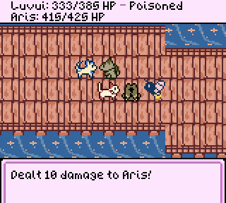
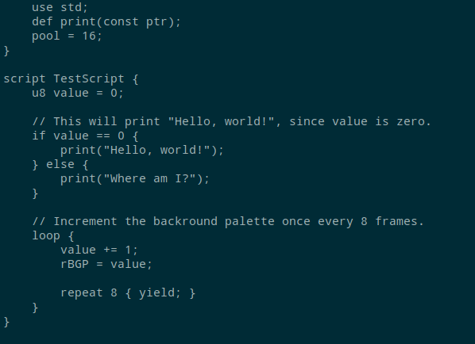

<head>
<title>Evie</title>

</head>

Hi! I'm Evie.
I'm currently working on a game called [esprit](https://github.com/evie-calico/esprit) and a complementary scripting language,
[evscript](https://github.com/evie-calico/evscript).
You can find a collection of my projects below.

# [Esprit](https://github.com/evie-calico/esprit)

A Game Boy "Mystery Dungeon" engine, making extensive use of the
console's limited video capabilities. Features 8 independant entities which
each have a unique color palette and set of graphics, procedurally
generated levels, a powerful variable-width-font engine which makes text
compact and easy to read, and a custom scripting language created from
scratch for this project, evscript.

### [evscript](https://github.com/evie-calico/evscript)

A simple yet versatile programming language originally made for the
Game Boy. Intended to replace the macro based scripting languages often
used in assembly projects, evscript provides control flow structures,
variable declarations and operators, and compact bytecode output which
saves space compared to C or even some assembly code.

<video class=image loop controls>
<source src="assets/evscript-hello-world.mp4" type="video/mp4">
</video>

### [evunit](https://github.com/evie-calico/evunit)

A unit testing program for Game Boy ROMs.
Configure tests using TOML files and instantly execute them with the built-in CPU emulator.

### [regex.inc](https://github.com/evie-calico/regex.inc)

regex.inc is a regex parser written in rgbasm.
Its primary use is picking apart the arguments to complex macros, but feel free to get creative.

### [Game Boy VRAM Allocation Library](https://github.com/evie-calico/gb-valloc-lib)

A simple Game Boy library for allocating video memory at runtime. Valloc
uses a very basic block pattern which takes advantage of the fact that
VRAM tiles can be addressed using a single byte.

### [Game Boy Sprite Objects Library](https://github.com/evie-calico/gb-sprobj-lib)

A small, lightweight library meant to facilitate the rendering of
sprite objects, including Shadow OAM and OAM DMA, single-entry "simple"
sprite objects, and Q12.4 fixed-point position metasprite rendering.
